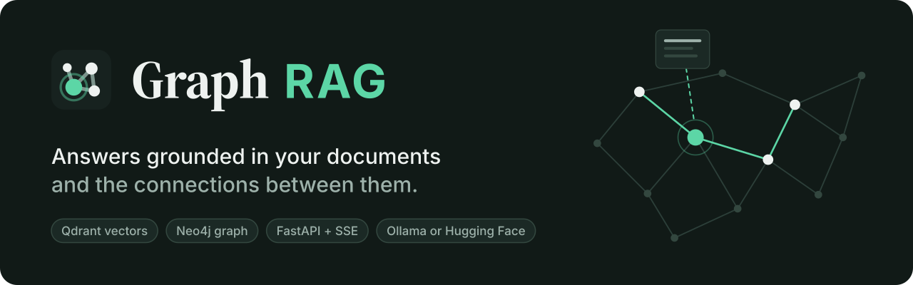
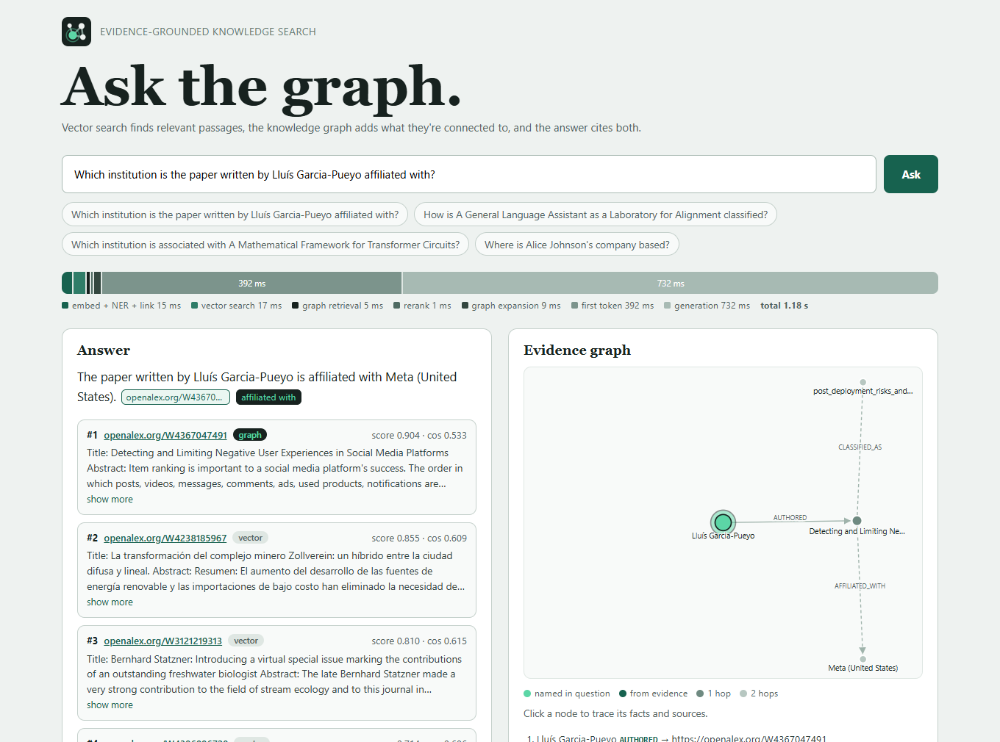
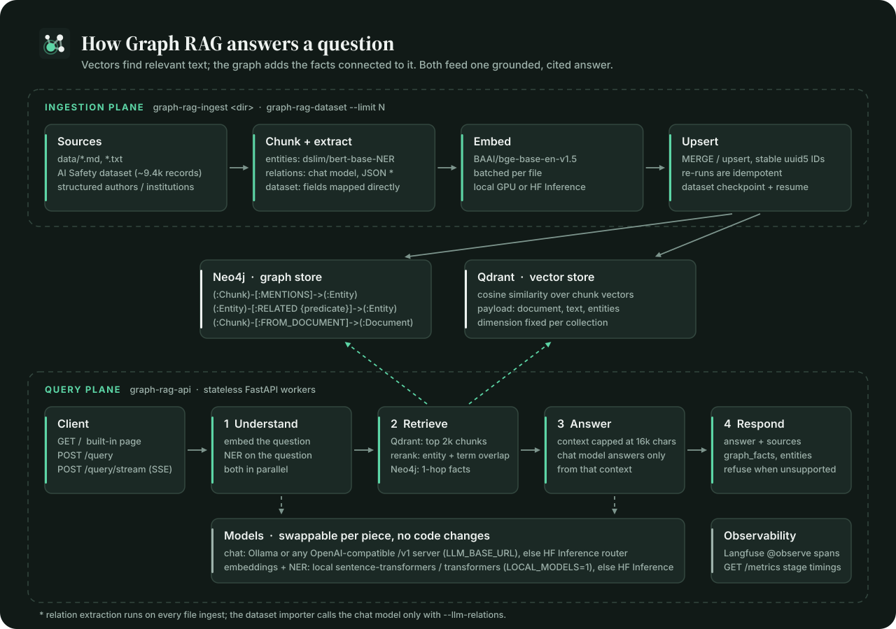

<p align="center">
  
</p>

<p align="center">
  
  
  
  
  
</p>

# Graph RAG

A Graph RAG system: semantic document retrieval combined with entity and relationship traversal, so answers can draw on both unstructured evidence and structured connections between things.

Ask *"Which institution is the paper written by Lluís Garcia-Pueyo affiliated with?"*. The answer comes from a paper whose text never mentions that author, so plain vector search can't find it. Graph RAG links the name in the question to an author node, follows `AUTHORED → paper → AFFILIATED_WITH`, retrieves the paper through the graph, and answers *Meta (United States)*, with the passage and the fact it used both cited and clickable.

<p align="center">
  
</p>

The full design (ingestion plane, query plane, data ownership, reliability rules, security boundaries, scaling milestones) lives in [docs/ARCHITECTURE.md](docs/ARCHITECTURE.md). This file is the practical guide to running it.

<p align="center">
  
</p>

## How a question is answered

| Step | What happens | Why it matters |
|---|---|---|
| Understand | Embed the question, run NER, and **link entities** against a Neo4j full-text index, all in parallel | NER misses paper titles and classifications; linking finds any entity the question names. A candidate must have most of its own words in the question, so *"papers"* doesn't link every title containing that word |
| Retrieve | Qdrant top `3k` chunks **plus chunks that mention a linked entity**, merged into one pool | The graph retrieves documents, not just facts: a question naming an author reaches the author's paper even though its text never mentions them |
| Rerank | cosine + bounded entity coverage + term coverage + a fixed bonus for graph-reached chunks | Each bonus is a fraction in [0, 1], so shared common words can't bury the passage that actually answers |
| Expand | Directed graph facts up to **2 hops** from the seeds: up to 6 edges per node, specific neighbours before hubs, no expansion through nodes with more than 40 relationships, 24 facts max | Enough for author → paper → institution, without one popular institution flooding the context |
| Answer | Context = named entities, then graph facts, then sources (each ≤1,500 chars, total ≤16k). The prompt treats context as data and explains the fact notation | Facts used to be cut off behind long abstracts; now they come first |
| Respond | Answer + `sources` (each tagged `vector`, `graph`, or `vector+graph`) + `graph` (nodes/edges) + per-stage `timings` | The client can show *why* the answer is what it is |

### Measured on the golden set

10 reviewed questions, including 3 multi-hop questions that name only an author and 2 with no answer. Same index (all 9,439 AI Safety records), same model (`llama3.2` 3B through Ollama), `--limit 8 --answers`:

| | cases passed | recall@8 | MRR | multi-hop answers |
|---|---|---|---|---|
| before (`main` @ `7d76a50`) | 2 / 10 | 0.625 | 0.625 | 0 / 3 |
| after | **10 / 10** | **1.00** | **1.00** | **3 / 3** |

Precision@8 is 0.125 by construction: each question has one expected source among eight returned. Ten cases show direction, not statistical significance.

## Two ways to run it

**Local prototype** — zero setup, in-memory, regex-based entity extraction. Good for tests and offline development, not for a real corpus.

**Full pipeline** — Neo4j for entities/relationships, Qdrant for chunk vectors, a chat model for relation extraction and answers, and an embeddings+NER model for indexing. Every one of those four pieces is swappable between a hosted service and something running on your own machine — pick per-piece, not all-or-nothing.

## Local prototype

```powershell
uv sync
uv run pytest
uv run graph-rag data "Where is Alice Johnson's company based?"
```

Add your own `.md`/`.txt` files to `data/` and query the directory again. This path never leaves your machine and needs no credentials — it's [src/graph_rag/core.py](src/graph_rag/core.py), a self-contained ~90 lines.

## Full pipeline

### The four pieces, and your options for each

| Piece | Hosted | Self-hosted |
|---|---|---|
| Graph store | Neo4j AuraDB (free tier) | Neo4j in Docker |
| Vector store | Qdrant Cloud (free tier) | Qdrant in Docker |
| Chat (relations + answers) | Hugging Face Inference API — billed per token | [Ollama](https://ollama.com), any OpenAI-compatible local server |
| Embeddings + NER | Hugging Face Inference API — free | Local GPU/CPU via `sentence-transformers`/`transformers` |

Free-tier cloud instances get suspended after inactivity, and HF's chat inference has a monthly credit cap — the self-hosted column has no such limits and, with a GPU, is faster. Mix and match freely; nothing else in the code changes based on which you pick.

### Fastest path: everything local

```powershell
# Graph + vector stores
# bound to loopback only; Qdrant runs non-root with an API key
docker run -d --name graph-rag-neo4j -p 127.0.0.1:7474:7474 -p 127.0.0.1:7687:7687 -v graph-rag-neo4j-data:/data -e NEO4J_AUTH=neo4j/yourpassword neo4j:5-community
docker run -d --name graph-rag-qdrant -p 127.0.0.1:6333:6333 -p 127.0.0.1:6334:6334 -v graph-rag-qdrant-data:/qdrant/storage -e QDRANT__SERVICE__API_KEY=your-qdrant-key qdrant/qdrant:v1.19.1-unprivileged

# Chat model
winget install Ollama.Ollama   # or https://ollama.com
ollama pull llama3.2
```

Then `.env`:

```bash
HF_TOKEN=your_hf_token              # still needed unless LOCAL_MODELS=1 (embeddings/NER)
HF_EMBEDDING_MODEL=BAAI/bge-base-en-v1.5
HF_NER_MODEL=dslim/bert-base-NER
HF_LLM_MODEL=llama3.2               # the model name your chat backend serves
LLM_BASE_URL=http://127.0.0.1:11434/v1   # blank = use HF Inference for chat instead
LOCAL_MODELS=1                      # 1 = embeddings/NER run locally; blank = use HF Inference

NEO4J_URI=bolt://127.0.0.1:7687
NEO4J_USERNAME=neo4j
NEO4J_PASSWORD=yourpassword

QDRANT_URL=http://127.0.0.1:6333
QDRANT_API_KEY=your-qdrant-key      # same value as QDRANT__SERVICE__API_KEY above
QDRANT_COLLECTION=graph_rag_chunks
```

Use `127.0.0.1`, not `localhost`. On Windows, `localhost` tries IPv6 `::1` first, and the containers only listen on IPv4, so every Neo4j and Qdrant call waited about 2 s for the fallback. Keep the Qdrant image's minor version within one of `qdrant-client` (1.19 in `uv.lock`); the client warns otherwise.

`LOCAL_MODELS=1` loads `BAAI/bge-base-en-v1.5` and `dslim/bert-base-NER` into memory on first use and puts them on your GPU if `torch.cuda.is_available()`. This repo pins a CUDA-enabled `torch` build via `[tool.uv.sources]` in `pyproject.toml` — on Windows, `uv add torch` alone gets you a CPU-only wheel, so that pin matters. Verify it landed correctly:

```powershell
uv run python -c "import torch; print(torch.cuda.is_available(), torch.cuda.get_device_name(0))"
```

### Cloud path instead

Sign up for [Neo4j AuraDB](https://neo4j.com/cloud/aura/) and [Qdrant Cloud](https://cloud.qdrant.io) free tiers, leave `LLM_BASE_URL` and `LOCAL_MODELS` blank, and fill in `NEO4J_URI`/`QDRANT_URL`/`QDRANT_API_KEY` with the values from each dashboard instead of localhost. Everything else is identical.

### Run it

```powershell
uv sync
uv run graph-rag-ingest data
uv run graph-rag-api          # http://127.0.0.1:8000
```

The API listens on loopback by default because it has no authentication. Set `GRAPH_RAG_HOST=0.0.0.0` (and optionally `GRAPH_RAG_PORT`) only inside a container or behind an authenticating proxy.

The API exposes:

| Route | Purpose |
|---|---|
| `GET /health` | liveness check |
| `GET /metrics` | per-stage timing/counters snapshot |
| `POST /query` | ask a question, get the full answer back at once |
| `POST /query/stream` | same, but as Server-Sent Events — an `evidence` event first, then `token` events as the answer generates, then `done` |
| `GET /` | the built-in page: streamed answer with clickable source and fact citations, ranked sources, an interactive evidence graph, and a stage timing bar. Deep-linkable as `/?q=...` |
| `GET /favicon.svg` | the brand mark used by the built-in page (not in the OpenAPI schema) |

```powershell
Invoke-RestMethod http://localhost:8000/query -Method Post -ContentType "application/json" -Body '{"question":"Where is Alice Johnson's company based?"}'
```

Every response returns `sources`, `graph_facts`, `retrieved_entities`, `graph` (`nodes` with a role of `linked` / `seed` / `hop1` / `hop2` and the source IDs that mention them; `edges` with direction and hop) and `timings` (milliseconds per stage) alongside the answer. Citations and graph reasoning stay inspectable by the client instead of being buried inside the generated text. Each source carries the reranked `score`, the raw cosine `similarity`, and how it was found (`retrieval`). Questions are capped at 2,000 characters. When context doesn't support an answer, `/query` returns the canned refusal after generating; `/query/stream` catches the empty-context case before generating and streams the refusal directly, so a model that hedges mid-stream is shown as-is rather than retroactively rewritten.

## Why two retrieval databases, and swappable models

Semantic similarity and relationship traversal are different query shapes, so they get different specialized stores rather than one database doing both. Neo4j makes multi-hop Cypher queries natural; Qdrant is built for vector search at scale. A single Postgres-with-extensions deployment is a legitimate simpler alternative for a smaller system — this project chose clearer scaling boundaries instead.

Models are separated the same way, by job: a small NER model handles entity candidates cheaply, an instruction-tuned chat model handles schema-constrained relation extraction and grounded answers, and neither is hardwired to a specific provider. `chat_client` in `HuggingFaceModels` points at HF's router by default and at `LLM_BASE_URL` when one is set — any OpenAI-compatible `/v1/chat/completions` server works, tested against both HF's hosted router and a local Ollama. Embeddings/NER take the same shape: HF Inference by default, local `sentence-transformers`/`transformers` when `LOCAL_MODELS=1`. Swapping either doesn't touch the storage layer.

Add dependencies through `uv`:

```powershell
uv add <package>
uv add --dev <package>
uv sync
```

## AI Safety Dataset

The first real corpus is `Disclosures-SSRC/AI-Safety_Reliability_Reseach` — roughly 9,439 OpenAlex-style research records with titles, abstracts, authors, institutions, and safety classifications. It's structured data rather than long documents, so the importer preserves its existing author/paper/institution/classification relationships instead of asking an LLM to rediscover every fact.

```powershell
uv run graph-rag-dataset --limit 100   # small run first
uv run graph-rag-dataset --limit 0     # then the full dataset (about 5 minutes on an RTX 3060 laptop GPU)
```

Records are embedded and written in batches (`--batch-size`, default 64): one embedding call, one `UNWIND` write to Neo4j, and one Qdrant upsert per batch, on top of uniqueness constraints that turn every `MERGE` into an index lookup. The full 9,439-record import measured 4 min 41 s (about 35 records/s, versus 0.4 records/s before batching). Ingestion checkpoints atomically at `.graph-rag/ai-safety-checkpoint.json` after both stores have accepted a batch; an interrupted run resumes by paper ID when repeated. Use a different `--checkpoint` path to start a fresh collection.

Re-running an import is safe: chunk IDs are content hashes and every write is an upsert, so vector points and structured dataset facts don't duplicate. Relations extracted by the chat model are the exception, because a re-run can phrase a predicate differently (`based in` vs `is based in`) and add a parallel edge. Re-running `graph-rag-ingest data` once added 1 node and 1 relationship that way.

Add `--llm-relations` only when you want the chat model to extract additional relationships from abstracts and safety summaries — this adds one chat call per record, so it costs more and runs slower than the default structured-field import.

## Golden Evaluation Set

`evaluation/golden_questions.json` is the quality baseline: direct lookup, classification, graph paths, multi-hop author → paper → institution/classification questions, and two no-answer cases.

```powershell
uv run python evaluation/evaluate.py --limit 8 --answers --report .graph-rag/evaluation-report.json
```

Before scoring, the evaluator checks the ground truth itself. Every expected source must be indexed, and if its chunk has a title, the question must name that title (multi-hop cases opt out with `"question_names_title": false`). This check found a mislabelled case: `W4296558812` is a paper about transformer *windings*, not *"A Mathematical Framework for Transformer Circuits"*, and it had been "passing" only because both titles contain the word *transformer*.

Reports `precision_at_k`, `recall_at_k`, and `mrr` from reviewed expected source IDs — no LLM judge involved. Add `--answers` to also check generated-answer content, or `--ragas` for model-judged faithfulness/relevance/context scores through an OpenAI-compatible evaluator endpoint (e.g. a local router, or OpenAI itself):

```powershell
$env:OPENAI_API_KEY = "your-key"
$env:OPENAI_BASE_URL = "http://localhost:20128/v1"
$env:RAGAS_LLM_MODEL = "your-evaluator-model"
$env:RAGAS_EMBEDDING_MODEL = "your-embedding-model"
uv run python evaluation/evaluate.py --limit 8 --ragas
```

RAGAS needs its own evaluator-capable chat and embedding models available at that endpoint — review its scores alongside the deterministic source metrics, it grades answer quality but doesn't replace a reviewed ground-truth set.

### UI smoke test

`evaluation/ui_smoke.py` drives the built-in page in headless Microsoft Edge against a running API. It streams a query, clicks the linked graph node and the first citation, and submits an `` question. It fails if script ran, markup was injected, the console logged errors (including CSP violations), or the graph interactions had no effect:

```powershell
uv run graph-rag-api   # separate terminal
uv run --no-project --with playwright==1.55.0 python evaluation/ui_smoke.py .graph-rag "Which institution is the paper written by Lluís Garcia-Pueyo affiliated with?"
```

## Langfuse Tracing

Every query is one Langfuse trace. Tracing stays inert until keys are set, so local development works without it.

```bash
LANGFUSE_PUBLIC_KEY=pk-lf-...
LANGFUSE_SECRET_KEY=sk-lf-...
LANGFUSE_BASE_URL=https://cloud.langfuse.com   # or your self-hosted Langfuse
LANGFUSE_TRACING_ENVIRONMENT=development       # optional, separates dev/staging/prod
LANGFUSE_SAMPLE_RATE=1.0                       # optional, fraction of queries traced
TRACE_CONTENT=metadata                         # or: full
```

```text
graph-rag.query                [span]        /query and /query/stream
├─ graph-rag.retrieve          [retriever]   source IDs + scores, candidate counts, stage timings
│  ├─ retrieve.embedding / entity_extraction / entity_linking   (parallel, nested via copied context)
│  ├─ retrieve.vector_search / graph_retrieval / reranking
│  └─ retrieve.graph_expansion
└─ llm.answer                  [generation]  model, parameters, token usage, time to first token
```

`/query` returns `trace_id`, and the `done` event of `/query/stream` carries it too. `evaluation/evaluate.py` runs each golden case in its own trace and attaches `answer_correct`, `source_recall`, `relationship_recall` and `case_passed` scores to it. Ingestion traces `llm.relations` generations.

**What leaves the process.** `TRACE_CONTENT` decides it, in code rather than in the prompt:

| | `metadata` (default) | `full` |
|---|---|---|
| Document IDs, scores, counts, timings, model, token usage | yes | yes |
| Question, prompt, retrieved context, graph facts, answer | **no** | yes, with credential-shaped strings and emails redacted and strings capped at 4,000 characters |

Every `@observe` sets `capture_input=False`/`capture_output=False`, and text reaches a span only through `tracing.record()`, which drops it unless the mode is `full`. Any other value, including a typo, means `metadata`. A Langfuse `mask` adds the redaction in both modes. `tests/test_tracing.py` checks this against an in-memory OpenTelemetry exporter: canary words from the question, passages and answer must not appear in any exported attribute in `metadata` mode. Redaction is pattern-based. It does not catch names or other free-form personal data, so keep `full` for development data.

## Security model

This is a single-tenant system with no authentication, so treat it as a local or internal tool. In code:

- **Untrusted text is never parsed as HTML.** The built-in page builds DOM with `textContent` and `createElementNS` only. The inline script and stylesheet are pinned by SHA-256 in a strict CSP (`default-src 'none'`, no `unsafe-inline` or `unsafe-eval`), plus `nosniff`, `no-referrer` and `frame-ancestors 'none'`. Only http(s) source IDs that came from the index become links (`noopener noreferrer`); nothing the model writes becomes a link. A citation chip appears only for an ID that was actually retrieved, or a fact that is actually in the evidence graph.
- **No query language reaches the stores.** Cypher is fully parameterised. The full-text entity-linking query keeps only lowercase letter/digit tokens, so no Lucene operator, wildcard, fuzzy/regex syntax or field selector can get through.
- **Bounded work per request.** Questions are capped at 2,000 characters, `limit` at 50, graph expansion at 24 facts and 2 hops, and context at 16k characters.
- **Loopback by default.** The API, Neo4j and Qdrant all bind to `127.0.0.1` in the documented setup, and Qdrant requires an API key.
- **Prompt injection is mitigated, not solved.** The prompt fences retrieved text as data and tells the model to ignore instructions inside it. That is defence in depth only, because the model is not a security boundary. The model has no tools, and its output only ever becomes plain text in the page.

Not covered yet: authentication, per-tenant data isolation and rate limiting. Error events can also include backend exception text. Put the API behind an authenticating proxy before exposing it.

## Brand assets

Everything in [`docs/brand/`](docs/brand/) is generated by one script, [`docs/brand/tools/build_brand.py`](docs/brand/tools/build_brand.py): banner, social preview, logo mark, horizontal lockups, favicons, the iOS touch icon, and the architecture diagram above. Text is outlined to paths, so the SVGs render the same everywhere without fonts installed. See [`docs/brand/README.md`](docs/brand/README.md) for the palette and which file to use where.

```powershell
cargo install resvg --locked --version 0.48.1   # once, for the PNG exports
uv run docs/brand/tools/build_brand.py
```

The script also regenerates `src/graph_rag/brand.py`, which the API serves as `/favicon.svg`.
